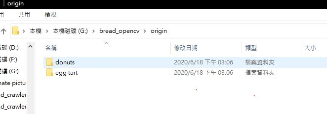

# img_reshape
> 更改圖片大小

### Installation
需要安裝以下套件
* opencv
```
pip install opencv-python
```

### Usage
1. 你必須先建立`origin`檔案夾，存放要轉換的圖片

2. 建立完成後，就可以跑`main.py`

普通用法:
```
直接點main.py
```

在編譯器的用法:
```
在main.py直接運行
```

命令指令欄的用法:
```
python main.py
```

### Settings

如果想更改存放檔案的位置，可以到`settings.py`修改這兩個變數就行
```
ORGIN_IMG_PATH = 'origin'
DESTINATION_IMG_PATH = 'dstImg'
```